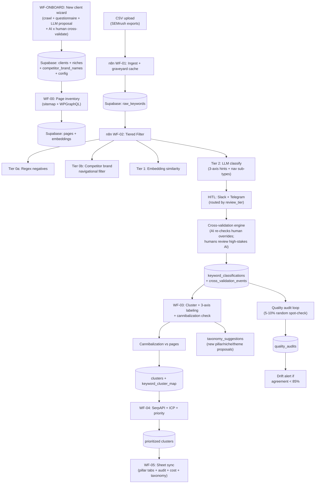

# Architecture — Phase 1 (Keyword Cleaning + Clustering Pipeline)

Version: v3.2 (locked for build)

This document is the canonical reference for what we are building. The live planning history is in `.cursor/plans/phase1-keyword-pipeline_*.plan.md`; this file is the doc the system runs on.

For Phase 2+ work and deferred items, see [`ROADMAP.md`](./ROADMAP.md).
For specific design decisions and their rationale, see [`adr/`](./adr/).

---

## 1. What this system does

A multi-tenant pipeline that takes a messy 60k+ keyword corpus (typically SEMrush exports from many competitors) and produces prioritized topical clusters that are ready for content production.

Every client in the system is independent: their own service taxonomy, niches, ICP persona, brand voice, gold examples, and review tier. The system onboards a new client in ~30 minutes via a website crawl + structured questionnaire, with AI cross-validating every human input.

Output: clusters on a 3-axis taxonomy (`service_pillar` x `vertical_niche` x `content_theme`) with priority scores driven by conversion intent + ICP match + first-party-data availability — not by KD.

---

## 2. Architecture diagram



---

## 3. The 3-axis taxonomy (conceptual core)

Every cluster carries three independent labels:

| Axis | Definition | Source | Mutability | Drives |
|---|---|---|---|---|
| `service_pillar` | The client's actual service offering, anchored to a real landing-page URL they sell from. | Per-client declared in `clients.config.service_pillars` (set at onboarding from crawl + questionnaire). | Mostly stable. | WHICH `/services/*` page the cluster converts toward. |
| `vertical_niche` | The industry the searcher operates in. | Declared at onboarding; auto-extended via `taxonomy_suggestions` as data reveals new niches. | Mutable. | WHICH variant of content + which case studies surface. |
| `content_theme` | The KIND of content concern (compliance, pricing, comparison, how-to, etc.). | LLM-derived per cluster. | Fully dynamic. | The article TEMPLATE used in Phase 2. |

See [ADR 0001](./adr/0001-three-axis-taxonomy.md) for the full rationale.

---

## 4. Bidirectional verification engine

Phase 1's bulletproofing layer. Both directions of decision get cross-validated:

- **Human -> AI:** every human override fires an AI second-pass with extra evidence. If AI still disagrees with the human, escalate to senior reviewer.
- **AI -> Human:** every high-stakes AI decision (new pillar suggestion, new niche, cannibalization-risk cluster, low-confidence assignment) is auto-queued for human review.
- **Gold-example pollution check:** when an intern adds a new `gold_example`, AI re-classifies 20 nearby keywords to make sure the new example didn't break previously-correct decisions.
- **Prompt drift detection:** every classification stores `llm_prompt_hash`; quality audits track agreement rate; rolling rate < 85% -> alert; < 70% -> auto-pause auto-approval.
- **Onboarding cross-validation:** questionnaire answers compared against website crawl evidence and seed keywords; inconsistencies flagged before saving.

All cross-validation events log to `cross_validation_events` with severity (low/medium/high).

See [ADR 0002](./adr/0002-bidirectional-verification.md) for the full rationale.

---

## 5. Review tiers (per-client cost/quality control)

| Tier | What gets reviewed | Human time / 60k corpus | API cost | Best for |
|---|---|---|---|---|
| `tier_a_ai_only` | Nothing (cross-validation engine still flags high-severity events) | 0 min | ~$5-8 | Low-budget clients, internal tests |
| `tier_b_hitl_borderline` (default) | Tier 2 borderline + low-confidence + cluster theme approval | ~30-60 min | ~$10-15 | Most clients, standard retainer |
| `tier_c_hitl_random_sample` | Tier B + 10% random spot-check on AI-approved | ~2-3 hrs | ~$10-15 | Competitive niches, new client onboarding |
| `tier_d_hitl_full` | Every passed keyword + every cluster + every priority decision | ~10-15 hrs | ~$10-15 | Premium retainer clients, regulated industries |

---

## 6. Cost guardrail (auto-pause)

Every pipeline run computes a hard ceiling:

```
per_run_ceiling_usd = (clients.config.monthly_api_budget_usd / expected_runs_per_month)
                     * (per_run_cost_ceiling_pct / 100)
```

Defaults: `monthly_api_budget_usd=50`, `expected_runs_per_month=4`, `per_run_cost_ceiling_pct=150` -> per-run ceiling = $18.75.

Every API call increments `api_cost_log` AND `pipeline_runs.cost_so_far_usd`. Before each expensive batch (Tier 2 LLM, SerpAPI), an IF node gates on `cost_so_far_usd >= cost_ceiling_usd`. Exceeded:
1. `pipeline_runs.status = 'paused_cost_ceiling'`
2. High-severity HITL alert (Slack + Telegram if configured)
3. Wait for human approve/extend/abort decision
4. Log to `cross_validation_events` with `event_type=cost_ceiling_hit`

See [ADR 0003](./adr/0003-cost-ceiling-auto-pause.md).

---

## 7. Tech stack

- **Orchestration:** n8n (existing instance). Workflows exported as JSON to `n8n-workflows/exports/`.
- **Source of truth:** Supabase (Postgres + pgvector + RLS + Auth) — **a separate project** from any client-facing site DB. See [ADR 0004](./adr/0004-supabase-separate-from-prisma.md).
- **LLM gateway:** OpenRouter (unified `/chat/completions` + `/embeddings` API). Model selection is dynamic via env vars (`DEFAULT_EMBEDDING_MODEL`, `DEFAULT_LLM_MODEL`, `DEFAULT_CROSS_VALIDATION_MODEL`) — swap them to change models without code, prompt, or workflow edits. See [ADR 0005](./adr/0005-openrouter-unified-gateway.md).
- **Embeddings:** default `openai/text-embedding-3-small` @ 768 dim (matches `vector(768)` schema; OpenAI's `dimensions` parameter avoids any schema migration).
- **LLM classifier (Tier 2 + NER + ICP + theme + onboarding):** default `google/gemini-2.0-flash-001` via OpenRouter, with structured JSON output.
- **Cross-validation second pass (bidirectional verification):** default `openai/gpt-4o-mini` — deliberately a different model family from the primary classifier so that "AI second-pass agrees" is a meaningful audit signal.
- **Clustering:** HDBSCAN via Python FastAPI worker (`python-worker/`), deployed on Cloud Run / Railway / Fly.io.
- **HITL:** Slack interactive cards AND Telegram inline keyboards in parallel. Same normalized webhook contract — drop-in dashboard swap in Phase 2.
- **CMS integration:** Apollo + WPGraphQL (reuses Vercel site's existing config).
- **Intern view:** Google Sheets, read-only, auto-synced.

---

## 8. The 7 modular n8n workflows

### WF-ONBOARD — Client onboarding wizard

Entry point for every new client. Inputs: website URL + (optional) competitor list + (optional) seed keyword sample.

1. Crawl client site (sitemap.xml + top 20 pages by depth).
2. LLM site analysis -> proposes service_pillars, ICP signals, brand voice, industries, competitor mentions.
3. Intern fills structured questionnaire (pre-filled from step 2).
4. AI cross-validates questionnaire vs site crawl; flags inconsistencies.
5. Human reviews flags + accepts/edits.
6. AI second-pass cross-validates final config against seed keyword sample.
7. Writes to `clients` + `niches` + `competitor_brand_names` + initial `gold_examples`.
8. `clients.onboarding_status = active`.

### WF-00 — Page inventory sync

Daily cron. Crawls client sitemap + queries WPGraphQL + parses Next.js app router file tree (if path provided). Upserts `pages` + computes `pages.embedding` for cannibalization checks.

### WF-01 — CSV ingest

Webhook or manual. Parse + normalize + dedupe + graveyard cache check (skip previously rejected). Bulk insert into `raw_keywords`. Validates required SEMrush columns.

### WF-02 — Tiered filter

- **Tier 0a (regex, free):** Postgres function `apply_tier0_regex_filter`.
- **Tier 0b (competitor-brand navigational, free):** Postgres function `apply_tier0_competitor_navigational_filter` + `navigational_competitor_strategy` routing.
- **Tier 1 (embeddings, ~$0.60):** OpenRouter `/embeddings` -> cosine similarity vs gold_examples positive/negative centroids.
- **Tier 2 (LLM classify, ~$3-8):** batch JSON output: `intent_type` + `niche_hint` + `content_theme_hint` + `is_lsi_of_canonical_idea` + confidence + reasoning.
- **HITL routing** by `clients.config.review_tier`.
- **Bidirectional verification** on every human override.

### WF-03 — Cluster + 3-axis labeling + cannibalization check

Calls Python worker -> HDBSCAN -> canonical head term + role-assigned members.

For each cluster, LLM produces `theme_label` + `suggested_service_pillar` (with confidence) + `suggested_vertical_niche_id` (with confidence) + `content_theme`.

Routing by confidence:
- `> 0.85` -> auto-assign
- `0.5-0.85` -> propose to human
- `< 0.5` and no existing pillar fits -> LLM proposes a NEW pillar via `taxonomy_suggestions`

Cannibalization check: cluster head embedding vs all `pages.embedding`. If similarity > 0.85 -> flag.

### WF-04 — ICP + priority score

SerpAPI top-3 per surviving cluster (budget-capped). LLM ICP scoring vs `clients.config.icp_persona`. Computes `priority_score`:

```
priority_score = (commercial_intent_weight * 5)
               + (icp_match_score * 3)
               + (log(total_volume + 1) * 1)
               - (avg_kd * 0.5)
               + (first_party_data_bonus * 2)
               + (pillar_match_bonus * 1.5)
               + (niche_focus_bonus * 1)
               - (cannibalization_risk_penalty * 3)
```

`commercial_intent_weight` = `{transactional: 5, commercial_investigation: 3, navigational_branded: 4, local: 4, informational: 1, navigational_other: 0, navigational_competitor: -10}`.

### WF-05 — Sheet sync

Daily cron. Multi-tab Google Sheet per client:
- One tab per pillar
- `Niches` (pivot)
- `Themes` (pivot)
- `Taxonomy-Suggestions` (pending proposals)
- `Audit` (quality audits summary)
- `Cross-Validation` (recent disagreement events)
- `Cost` (api_cost_log totals)

---

## 9. Cost matrix per 60k-keyword run (Tier B)

| Line item | Cost |
|---|---|
| WF-ONBOARD (once per client) | ~$0.30 |
| Tier 1 embeddings | ~$0.60 |
| Tier 2 LLM batch classify | $3-8 |
| Clustering compute | ~$0.05 |
| Cluster theme + pillar/niche labeling | ~$0.50 |
| Cannibalization embeddings | ~$0.01 |
| ICP SerpAPI | $1.50-10 |
| ICP LLM scoring | ~$1 |
| Cross-validation re-runs | ~$0.50 |
| **TOTAL** | **~$8-21** |

---

## 10. Explicit non-features in Phase 1

- **Multi-language support** — English-only. Detection + multilingual embeddings deferred.
- **Client-facing UI** — none. Sheet view + HITL are Webley-internal.
- **Per-client API key vault (BYOK)** — all clients share Webley keys. `api_cost_log` attributes per-client cost for internal accounting.
- **Content brief / draft / publish** — Phase 2.
- **Distribution / social** — Phase 3.
- **GSC monitoring / decay detection** — Phase 4.

Schema reserves tables/columns for all of these — zero migration when we get there.

---

## 11. Migration of existing PowerShell scripts

- `rebuild_negative_v2.ps1`, `rebuild_negative_keywords.ps1` -> Postgres function `apply_tier0_regex_filter`
- `categorize_keywords*.ps1` (KD bucketing) -> REMOVED. KD is a column, not a sheet. Priority is multi-factor.
- `combine_keywords*.ps1`, `extract_keywords.ps1` -> WF-01 ingest
- `update_and_filter.ps1` -> WF-01 + WF-02 split
- VBA color-fill -> Sheet conditional formatting on `priority_score`

Originals preserved in `scripts/powershell-legacy/`.

---

## 12. Done criteria

- [ ] Supabase v3 schema deployed (separate project), pgvector enabled, RLS tested with 2 dummy clients
- [ ] 7 n8n workflows live (WF-ONBOARD, WF-00..WF-05)
- [ ] Python clustering worker deployed and callable
- [ ] Bidirectional verification engine produces events for: human override, high-stakes AI decision, gold_example refresh, questionnaire-vs-crawl mismatch
- [ ] All 4 review tiers selectable per client and demonstrably routing differently
- [ ] WF-ONBOARD provisions Webley end-to-end in under 30 minutes
- [ ] WF-ONBOARD also provisions a SECOND dummy client with totally different pillars (e.g., hypothetical clothing DTC brand) — proves multi-tenancy
- [ ] WF-00 has seeded `pages` for Webley with embeddings
- [ ] Full 60k-keyword test run for Webley completes end-to-end
- [ ] 3-axis taxonomy populated on every cluster
- [ ] Navigational_competitor keywords correctly rejected (or routed to comparison content per strategy)
- [ ] `api_cost_log` totals under $25 for the run; cost ceiling logic verified by an artificial overrun
- [ ] Google Sheet view auto-syncs nightly with all required tabs
- [ ] Quality audit Slack/Telegram report shows >85% agreement on first week
- [ ] One-page intern SOP generated in `docs/intern-sop.md`
